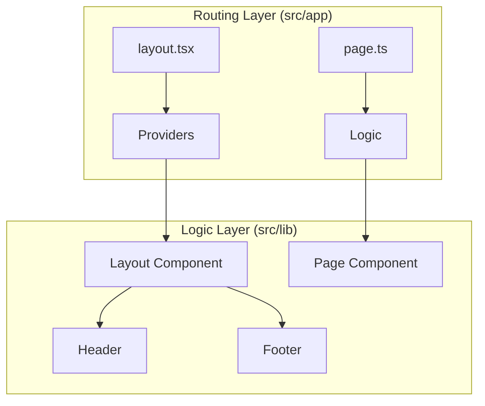

<div align="center">
  <a href="https://vercel.com/new/clone?repository-url=https%3A%2F%2Fgithub.com%2Fkingchun1991%2Fnextjs-chakra-starter-blog" target="_blank"></a> <a href="https://app.netlify.com/start/deploy?repository=https://github.com/kingchun1991/nextjs-chakra-starter-blog" target="_blank"></a> <a href="https://railway.app/new/template/aqmmai?referralCode=9lKVVo" target="_blank"></a>

<a href="https://stackblitz.com/github/kingchun1991/nextarter-chakra" target="_blank"></a>

</div>

This is a **Next.js + Chakra UI + TypeScript** starter template packed with modern tooling setup.

## 🚀 Features

-   **Framework**: [Next.js 16](https://nextjs.org/) (App Router)
-   **UI Library**: [Chakra UI v3](https://chakra-ui.com/)
-   **Styling Engine**: Emotion (via Chakra UI) + [next-themes](https://github.com/pacocoursey/next-themes)
-   **Language**: [TypeScript 5](https://www.typescriptlang.org/)
-   **Linting & Formatting**: [Biome](https://biomejs.dev/)
-   **E2E Testing**: [Playwright](https://playwright.dev/)
-   **Build System**: [Turborepo](https://turbo.build/repo)
-   **Icons**: [React Icons](https://react-icons.github.io/react-icons/)
  - `pre-commit`, `pre-push`, `commit-msg`, `prepare-commit-msg` hook configured
- 📱 **PWA-ready** - `next-pwa` configured, enabled by default, just disable it through `next.config.js`
- 🔎 SEO optimization configured - with `next-sitemap`.
  - you'll need to reconfigure or tinker with it to get it right according to your needs, but it's there if you need it.
- 🎨 basic responsive layout configured - don't need it? just remove it 😃
- 🤖 **Automatic Dependency Update** with [Renovate](https://renovatebot.com/)
- 🗒️ **MDX Blog** with enhanced features
  - 📊 **Table Support** - Beautiful, responsive tables with Chakra UI v3 styling
    - GitHub Flavored Markdown table syntax support via `remark-gfm`
    - Automatic column alignment (left, right, center)
    - Responsive design with horizontal scrolling on mobile
    - Dark/light mode support with hover effects
    - Enhanced table component for JSON data
  - 🖼️ Automatic Open Graph Cover generation
  - 👤 Author information and avatars
  - ⏱️ Reading time calculation

[](https://www.codefactor.io/repository/github/kingchun1991/nextjs-chakra-starter-blog)
[](https://sonarcloud.io/summary/new_code?id=kingchun1991_nextjs-chakra-starter-blog)[](https://sonarcloud.io/dashboard?id=kingchun1991_nextjs-chakra-starter-blog) [](https://sonarcloud.io/dashboard?id=kingchun1991_nextjs-chakra-starter-blog) [](https://sonarcloud.io/dashboard?id=kingchun1991_nextjs-chakra-starter-blog) [](https://sonarcloud.io/dashboard?id=sozonome_nextarter-chakra)

[](http://commitizen.github.io/cz-cli/)[](https://hits.seeyoufarm.com)


## 🏗 System Architecture

This project uses a **Split-Layer** architecture to separate Next.js routing concerns from React UI logic.



1. You can either click `Use this template` button on this repository and clone the repo or directly from your terminal:

```bash
npx degit kingchun1991/nextarter-chakra <YOUR_APP_NAME>
```

```mermaid
    subgraph "UI Layer (src/components)"
        HomePage --> Components
        Header --> Components
        Footer --> Components
    end
```

## 📂 Repository Structure

The code is organized to keep business logic and routing separate:

```bash
src/
├── app/            # Next.js App Router (Entry points)
│   ├── layout.tsx  # Global RootLayout & Providers
│   └── page.ts     # Re-exports Home from lib/pages
├── components/     # Shared UI components
│   └── ui/         # Primitives (Buttons, Inputs, etc.)
└── lib/            # Application Business Logic
    ├── layout/     # Shell components (Header, Footer)
    ├── pages/      # Page implementations (Home, etc.)
    └── styles/     # Theme configuration
```

## 🛠 Getting Started

### 1. Install Dependencies

This project uses [pnpm](https://pnpm.io/).

```bash
pnpm install
```

### 2. Run Development Server

```bash
pnpm dev
```

Open [http://localhost:3000](http://localhost:3000) to view it in the browser.

### 3. Build for Production

```bash
pnpm build
```

### 4. Run Tests

```bash
pnpm test:e2e
```

## 🧹 Code Quality

We use **Biome** for fast formatter and linter.

```bash
# Check code issues
pnpm biome:check

# Fix issues automatically
pnpm biome:fix
```
