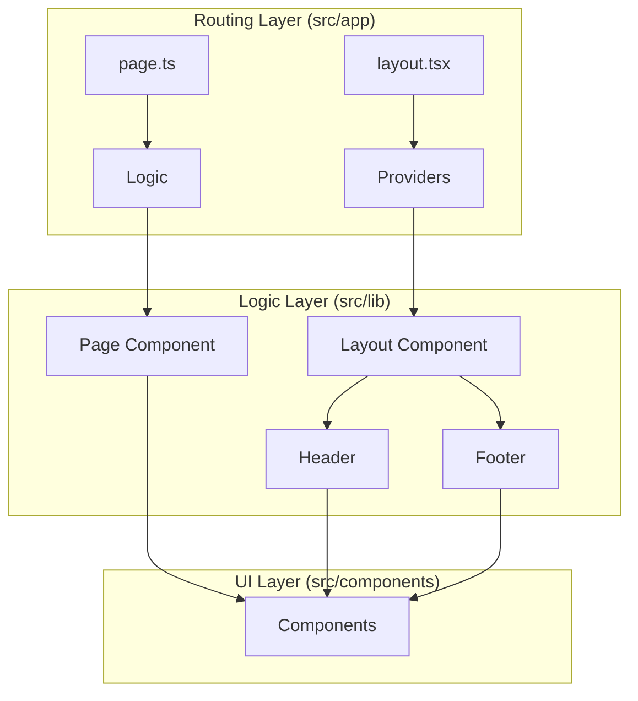

# nextarter-chakra


<div align="center">
  <a href="https://vercel.com/new/clone?repository-url=https%3A%2F%2Fgithub.com%2Fagustinusnathaniel%2Fnextarter-chakra" target="_blank"></a> <a href="https://app.netlify.com/start/deploy?repository=https://github.com/agustinusnathaniel/nextarter-chakra" target="_blank"></a> <a href="https://railway.app/new/template/aqmmai?referralCode=9lKVVo" target="_blank"></a>

<a href="https://stackblitz.com/github/agustinusnathaniel/nextarter-chakra" target="_blank"></a>

  <p>This is a <a href="https://nextjs.org/" target="_blank">Next.js</a> project bootstrapped with <code>create-next-app</code>, added with <a href="https://chakra-ui.com" target="_blank"><b>Chakra UI</b></a> and <a href="https://www.typescriptlang.org" target="_blank"><b>TypeScript</b></a> setup. <br/> Start developing right away!</p>

</div>

This is a **Next.js + Chakra UI + TypeScript** starter template packed with modern tooling setup.

## 🚀 Features

-   **Framework**: [Next.js 16](https://nextjs.org/) (App Router)
-   **UI Library**: [Chakra UI v3](https://chakra-ui.com/)
-   **Styling Engine**: Emotion (via Chakra UI) + [next-themes](https://github.com/pacocoursey/next-themes)
-   **Language**: [TypeScript 5](https://www.typescriptlang.org/)
-   **Linting & Formatting**: [Biome](https://biomejs.dev/)
-   **E2E Testing**: [Playwright](https://playwright.dev/)
-   **Build System**: [Turborepo](https://turbo.build/repo)
-   **Icons**: [React Icons](https://react-icons.github.io/react-icons/)

## 🏗 System Architecture

This project uses a **Split-Layer** architecture to separate Next.js routing concerns from React UI logic.



## 📂 Repository Structure

The code is organized to keep business logic and routing separate:

```bash
src/
├── app/            # Next.js App Router (Entry points)
│   ├── layout.tsx  # Global RootLayout & Providers
│   └── page.ts     # Re-exports Home from lib/pages
├── components/     # Shared UI components
│   └── ui/         # Primitives (Buttons, Inputs, etc.)
└── lib/            # Application Business Logic
    ├── layout/     # Shell components (Header, Footer)
    ├── pages/      # Page implementations (Home, etc.)
    └── styles/     # Theme configuration
```

## 🛠 Getting Started

### 1. Install Dependencies

This project uses [pnpm](https://pnpm.io/).

```bash
pnpm install
```

### 2. Run Development Server

```bash
pnpm dev
```

Open [http://localhost:3000](http://localhost:3000) to view it in the browser.

### 3. Build for Production

```bash
pnpm build
```

### 4. Run Tests

```bash
pnpm test:e2e
```

## 🧹 Code Quality

We use **Biome** for fast formatter and linter.

```bash
# Check code issues
pnpm biome:check

# Fix issues automatically
pnpm biome:fix
```
