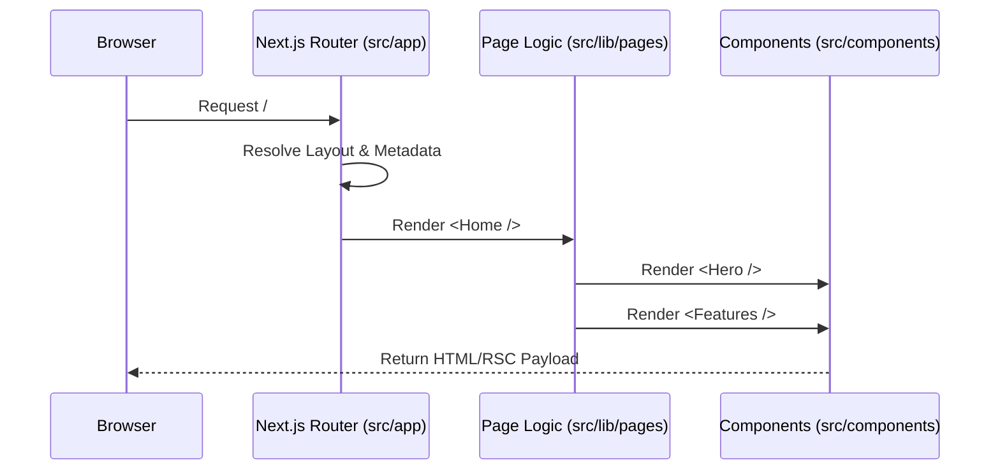

# System Specification

## 1. Core Architecture

The system follows a **View-Controller Separation** pattern adapted for Next.js App Router.

### 1.1 The Routing/Controller Layer (`src/app`)
-   **Responsibility**: Routing, Metadata (SEO), Server-Side Data Fetching (if applicable).
-   **Constraint**: Files here should contain minimal UI logic. They should primarily import and render a "Page Component" from `src/lib`.
-   **Example**:
    ```tsx
    // src/app/dashboard/page.tsx
    import { Dashboard } from '@/lib/pages/dashboard';
    export const metadata = { ... };
    export default Dashboard;
    ```

### 1.2 The Logic/View Layer (`src/lib`)
-   **Responsibility**: Actual React component tree, state management, interactions.
-   **Structure**:
    -   `layout/`: Global shell (Header, Footer).
    -   `pages/`: Feature-specific page roots.
    -   `styles/`: Global theme definitions.

### 1.3 The UI Primitives Layer (`src/components`)
-   **Responsibility**: Reusable, agnostic UI blocks.
-   **Invariant**: The contents of `src/components/ui` are generated by Chakra UI CLI. They should be treated as "Vendored Code" and not modified unless critically necessary.
-   **Constraint**: Should not depend on specific page logic or `src/lib` content.

## 2. Data Flow



## 3. Configuration & Invariants

### 3.1 Styling Engine
-   **Chakra UI v3**: The primary source of truth for all styling.
-   **Invariant**: Do not use utility classes (Tailwind) or custom `className` strings. Use Chakra props (`<Box p={4} />`) and Theme Tokens.
-   **Invariant**: Responsive design is mandatory. All layouts must use responsive object/array syntax (e.g. `w={{ base: 'full', md: 'auto' }}`).
-   **Theme**: Managed via `next-themes` for Dark/Light mode toggle, integrated with Chakra's system.

### 3.2 Build System
-   **Turborepo**: Manages the build pipeline.
-   **Biome**: Enforces code style.
-   **Invariant**: CI will fail if `biome:check` or `type:check` fails.

## 4. Known Limitations

-   **Server Components**: Since `src/lib/pages` components are typically imported into `src/app` and often use hooks (`useState`, `useEffect`), they are predominantly Client Components or must be carefully split if Server Components are needed.
-   **Default**: The current `src/lib/layout/index.tsx` uses `'use client'`, making the entire shell a Client Component.

## 5. Non-Goals

-   **Backend Logic**: This template is designed as a Frontend-first starter. While Next.js supports API routes, complex backend logic is out of scope for the initial template structure.
-   **State Management**: No global state library (Zustand/Redux) is included by default. State is local or URL-based.
