# Table Of Contents

<TableOfContents>

- [Table Of Contents](#table-of-contents)
- [Markdown Table](#markdown-table)
- [Callout with icon](#callout-with-icon)
- [Card](#card)
- [Mermaid Diagram](#mermaid-diagram)
- [github callout](#github-callout)
- [Steps](#steps)
- [Timeline Example](#timeline-example)

</TableOfContents>

# Markdown Table

| Name  | Age |
| ----- | --- |
| Alice | 20  |
| Bob   | 21  |

# Callout with icon

<Alert icon="👍" status="info" title="Generated by ChatGPT">
  Success Vitae reprehenderit at aliquid error voluptates eum dignissimos.
  asfasasfasfsafasfsafasfasfasfasfasfasasdfa Success Vitae reprehenderit at
  aliquid error voluptates eum dignissimos. Success Vitae reprehenderit at
  aliquid error voluptates eum dignissimos.
</Alert>

# Card

<ProductCard
  title="Amazon Basics Height-Adjustable Gaming Desk"
  price="$156.68"
  imgsrc="https://m.media-amazon.com/images/I/61kAyJ1BaBS._AC_SL1500_.jpg"
  url="https://www.amazon.com/Amazon-Basics-Height-Adjustable-Gaming-Monitor/dp/B08FJCHQ7V?keywords=adjustable%2BGaming%2BDesk&qid=1637327269&qsid=137-6306558-8614467&s=home-garden&sr=1-12&sres=B07J5YCNHW%2CB08F7FCFY1%2CB091YNDVGG%2CB089GM7CW1%2CB072MLNQXK%2CB088R9F4G5%2CB0892Z27D8%2CB08V14292V%2CB08FJCHQ7V%2CB094MW294G%2CB07JFFZGC4%2CB08S3X7SYQ%2CB08P58TY9D%2CB08BJ2XHY9%2CB09LM3CZF6%2CB079MGVDFY%2CB092V84BZM%2CB0834SSM1M%2CB08V53MTWW%2CB08668Y49C&srpt=DESK&th=1&linkCode=ll1&tag=standingify-20&linkId=530887a4b3e2d0e4a249c03495277259&language=en_US&ref_=as_li_ss_tl"
/>

# Mermaid Diagram

```mermaid
graph LR
    A[信用卡優惠及現金回贈] --> B[海外及網上交易]
    A --> C[Chil 商戶優惠]

    B --> D[海外消費]
    B --> E[網上簽賬]
```

```mermaid
graph LR
    A[消費] --> B[選擇合適信用卡]
    B --> C[使用現金回贈網站]
    C --> D[購買商品/服務]
    D --> E[獲得雙重回贈]
    E --> F[節省金錢]
    style A fill:#f9d5e5,stroke:#333,stroke-width:2px
    style B fill:#eeac99,stroke:#333,stroke-width:2px
    style C fill:#e06377,stroke:#333,stroke-width:2px
    style D fill:#c83349,stroke:#333,stroke-width:2px
    style E fill:#5b9aa0,stroke:#333,stroke-width:2px
    style F fill:#d6eadf,stroke:#333,stroke-width:2px
```





# github callout

> [!IMPORTANT]
> If deploying with a URL base path, like https://example.org/myblog you need an extra `BASE_PATH` shell-var to the build command:
>
> ```sh
> $ EXPORT=1 UNOPTIMIZED=1 BASE_PATH=/myblog yarn build
> ```
>
> => In your code, `${process.env.BASE_PATH || ''}/robots.txt` will print `"/myblog/robots.txt"` in the `out` build (or only `/robots.txt` if `yarn dev`, ie: on localhost:3000)

> [!TIP]
> Alternatively to `UNOPTIMIZED=1`, to continue using `next/image`, you can use an alternative image optimization provider such as Imgix, Cloudinary or Akamai. See [image optimization documentation](https://nextjs.org/docs/app/building-your-application/deploying/static-exports#image-optimization) for more details.

# Timeline Example

<Timeline>
  <TimelineItem
    title="Phase 1"
    subtitle="2024-01-01"
    avatar="https://gravatar.com/avatar/fdfbdfa4600c9305f2c9bfa7b591b78d?s=400&d=robohash&r=x"
  >
    Description for phase 1.
  </TimelineItem>
  <TimelineItem title="Phase 2" subtitle="2024-02-01">
    Description for phase 2.
  </TimelineItem>
</Timeline>
