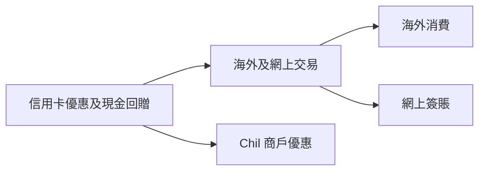
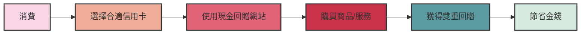

# 目錄

<TableOfContents>

- [目錄](#目錄)
- [Markdown 表格](#markdown-表格)
- [帶圖示的標注](#帶圖示的標注)
- [卡片](#卡片)
- [儲存庫卡片](#儲存庫卡片)
- [Mermaid 圖表](#mermaid-圖表)
- [GitHub 標注](#github-標注)
- [時間軸範例](#時間軸範例)

</TableOfContents>

# Markdown 表格

| 姓名  | 年齡 |
| ----- | ---- |
| Alice | 20   |
| Bob   | 21   |

# 帶圖示的標注

<Alert icon="👍" status="info" title="由 ChatGPT 生成">
  成功 Vitae reprehenderit at aliquid error voluptates eum dignissimos.
  asfasasfasfsafasfsafasfasfasfasfasfasasdfa 成功 Vitae reprehenderit at
  aliquid error voluptates eum dignissimos. 成功 Vitae reprehenderit at aliquid
  error voluptates eum dignissimos.
</Alert>

# 卡片

<ProductCard
  title="Amazon Basics 高度可調電競桌"
  price="$156.68"
  imgsrc="https://m.media-amazon.com/images/I/61kAyJ1BaBS._AC_SL1500_.jpg"
  url="https://www.amazon.com/Amazon-Basics-Height-Adjustable-Gaming-Monitor/dp/B08FJCHQ7V?keywords=adjustable%2BGaming%2BDesk&qid=1637327269&qsid=137-6306558-8614467&s=home-garden&sr=1-12&sres=B07J5YCNHW%2CB08F7FCFY1%2CB091YNDVGG%2CB089GM7CW1%2CB072MLNQXK%2CB088R9F4G5%2CB0892Z27D8%2CB08V14292V%2CB08FJCHQ7V%2CB094MW294G%2CB07JFFZGC4%2CB08S3X7SYQ%2CB08P58TY9D%2CB08BJ2XHY9%2CB09LM3CZF6%2CB079MGVDFY%2CB092V84BZM%2CB0834SSM1M%2CB08V53MTWW%2CB08668Y49C&srpt=DESK&th=1&linkCode=ll1&tag=standingify-20&linkId=530887a4b3e2d0e4a249c03495277259&language=en_US&ref_=as_li_ss_tl"
/>

# 儲存庫卡片

<RepoCard
  repo={{
    id: 123456789,
    name: 'nextjs-chakra-starter-blog',
    full_name: 'kingchun1991/nextjs-chakra-starter-blog',
    description: '使用 Next.js 和 Chakra UI 構建的現代部落格起始模板',
    html_url: 'https://github.com/kingchun1991/nextjs-chakra-starter-blog',
    stargazers_count: 42,
    forks_count: 15,
    language: 'TypeScript',
    updated_at: '2024-01-15T10:30:00Z',
    topics: ['nextjs', 'chakra-ui', 'blog', 'typescript'],
    owner: {
      login: 'kingchun1991',
      avatar_url: 'https://avatars.githubusercontent.com/u/12345?v=4',
    },
  }}
  readme="# Next.js Chakra 起始部落格\n\n使用 Next.js 和 Chakra UI 構建的現代部落格起始模板。\n\n## 功能\n\n- 使用 Chakra UI 的現代設計\n- 支援 MDX 豐富內容\n- TypeScript 類型安全\n- 響應式佈局\n\n## 開始使用\n\n```bash\nnpm install\nnpm run dev\n```"
/>

# Mermaid 圖表





# GitHub 標注

> [!IMPORTANT]
> 如果使用 URL 基礎路徑部署，例如 https://example.org/myblog，您需要在構建命令中添加額外的 `BASE_PATH` shell 變數：
>
> ```sh
> $ EXPORT=1 UNOPTIMIZED=1 BASE_PATH=/myblog yarn build
> ```
>
> => 在您的代碼中，`${process.env.BASE_PATH || ''}/robots.txt` 將在 `out` 構建中列印 `"/myblog/robots.txt"`（或如果 `yarn dev`，即在 localhost:3000 上僅列印 `/robots.txt`）

> [!TIP]
> 作為 `UNOPTIMIZED=1` 的替代方案，要繼續使用 `next/image`，您可以使用替代圖像優化提供商，例如 Imgix、Cloudinary 或 Akamai。有關更多詳細信息，請參閱[圖像優化文檔](https://nextjs.org/docs/app/building-your-application/deploying/static-exports#image-optimization)。

# 時間軸範例

<Timeline>
  <TimelineItem
    title="階段 1"
    subtitle="2024-01-01"
    avatar="https://gravatar.com/avatar/fdfbdfa4600c9305f2c9bfa7b591b78d?s=400&d=robohash&r=x"
  >
    階段 1 的描述。
  </TimelineItem>
  <TimelineItem title="階段 2" subtitle="2024-02-01">
    階段 2 的描述。
  </TimelineItem>
</Timeline>
